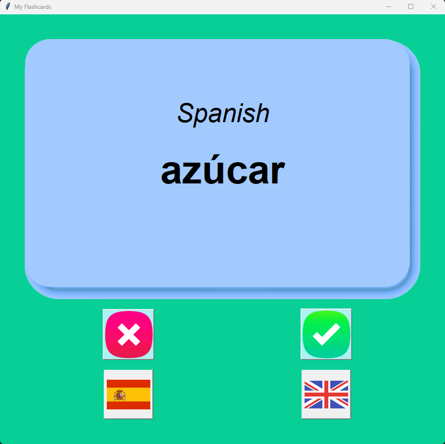

## Spanish to English learning flash card app

This is a simple app to help anyone learn Spanish. It is a simple flash card app that shows a Spanish word and the user has to guess the English translation. 

### Features

- The app has a simple UI with a button to show the answer and a button to note down if the user got the answer right or wrong.
- The app has a simple database that stores the words and their translations.
- The correctly answered words are removed from the database and the incorrectly answered words are added back to the database.

### How to use

- The app is simple to use. Just run the app and click on the button to show the answer.
- Then click on the button to note down if the user got the answer right or wrong.
- The app will then show the next word and the process repeats.
- Clink on spain logo or UK logo to see spanish and english meanings respectively.

### How to install

- The app is a simple python script that can be run on any system with python installed.
- The app uses the `tkinter` module for the UI and the `pandas` module for the csv database.
- The csv database is included in the repository and can be edited to add more words.

> Below is the snapshot of the app

